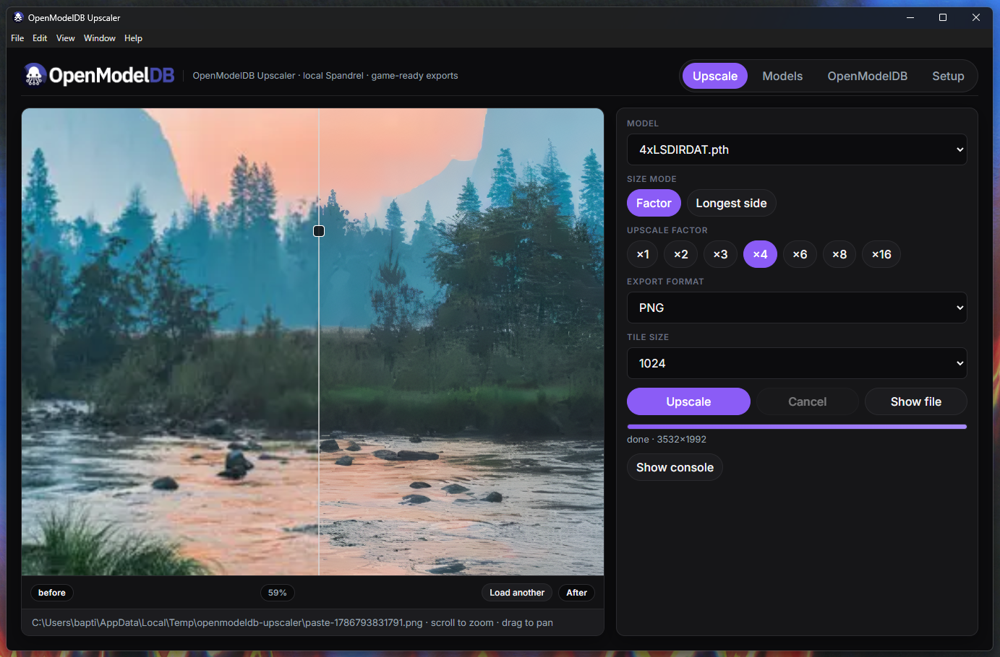
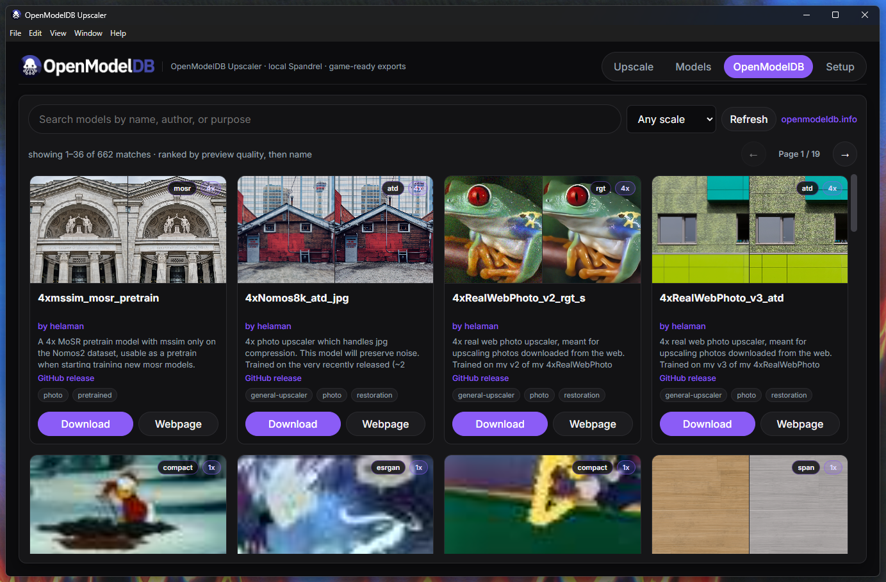

# OpenModelDB Upscaler

> Vibecoded.

Desktop app for **local AI texture upscaling** on **NVIDIA GPUs**, with browsing and download from [OpenModelDB](https://openmodeldb.info/).

Built with Electron + a Python [Spandrel](https://github.com/chaiNNer-org/spandrel) / PyTorch worker (**CUDA**).





> **NVIDIA GPU required.** This app targets CUDA on an NVIDIA graphics card. AMD / Intel GPUs are not supported. Without a working NVIDIA driver + CUDA-capable GPU, upscaling is not the intended use case.

---

## Features

- **NVIDIA CUDA** Spandrel inference (tiled, VRAM-friendly)
- **Size modes**
  - **Factor** — ×1 / ×2 / ×3 / ×4 / ×6 / ×8 / ×16
  - **Longest side** — presets 512 → 16384 px, plus a **custom** value (64–16384)
- **Tile size** — 128 / 256 / 384 / 512 / **1024** (larger = faster on high VRAM, more memory)
- **Export** — PNG, TGA, TIFF, DDS (uncompressed ARGB), EXR, WebP, JPEG, BMP
- **Alpha preserved** — RGB through the model, alpha resized separately
- **Before / after compare** viewer (drag / paste / load textures)
- **OpenModelDB** catalog — search, scale filter, pagination, previews, download (GitHub, Google Drive, MEGA, …)
- **Models** library — import / manage local weights (`.pth`, `.pt`, `.ckpt`, `.safetensors`)
- **Setup** tab — thin installers; AI runtime (~4.5 GB CUDA) on first use; optional reuse of an existing ComfyUI / Stability Matrix venv

---

## Requirements

| | |
| --- | --- |
| **OS** | Windows 10/11 **x64** |
| **GPU** | **NVIDIA** CUDA-capable GPU (required) |
| **Drivers** | Current [NVIDIA Game Ready / Studio drivers](https://www.nvidia.com/drivers) |
| **Disk** | ~5 GB free for the CUDA PyTorch runtime (first-time Setup) |
| **Dev only** | [Node.js](https://nodejs.org/) 18+, npm |

No Python install is required for the Setup / Portable builds — the app creates or reuses a venv itself.

---

## End users — install & first launch

### 1. Download

From [Releases](https://github.com/MiloAchille/OpenModelDB-Upscaler/releases):

| Artifact | Use when |
| --- | --- |
| `OpenModelDB Upscaler-*-Setup.exe` | Normal Windows install (Start Menu + optional uninstall) |
| `OpenModelDB Upscaler-*-Portable.exe` | No installer — run from a folder (USB / tools drive) |

Both builds are **thin**: they do **not** ship the multi‑GB PyTorch stack inside the EXE.

### Upgrading (Setup.exe)

Run a newer `*-Setup.exe` over an existing install — **no manual uninstall**.

- Same `appId` → Windows finds the previous install and **overwrites program files** in that folder (no second copy).
- **AppData** (AI runtime, settings, imported models) is **kept**.
- Shortcuts are refreshed. Close the app before upgrading if it’s running.
- Do **not** change `appId` in future builds or upgrades break.

Portable: replace the old `*-Portable.exe` (and keep `OpenModelDB-Upscaler-Data\` next to it).

### 2. Finish **Setup** (required once)

Open the **Setup** tab (see [Setup tab](#setup-tab) below). Other tabs stay locked until the AI runtime is ready.

### 3. Upscale a texture

1. Drop / paste / load an image (PNG, TGA, TIFF, JPG, WEBP, BMP, …)
2. Pick a model (or download one from **OpenModelDB**)
3. Choose **Factor** or **Longest side** (preset or custom)
4. Set export format + tile size
5. **Upscale** → **Show file** when done

---

## Setup tab

This is the AI environment screen (Spandrel / PyTorch / **NVIDIA CUDA**). Wheels download to `Downloads\OpenModelDB-Upscaler-Cache`; a full CUDA env is typically **~4.5 GB**.

Until Setup reports ready, **Upscale**, **Models**, and **OpenModelDB** stay locked.

### What you see

| UI | Purpose |
| --- | --- |
| Status badge | Checking / needs setup / ready / installing |
| Info cards | Interpreter, CUDA, disk usage, data folder, etc. |
| Step list | Diagnosed actions (reuse env, create venv, install missing deps, …) |
| **Active interpreter** | The Python path currently used for upscaling |
| **Existing environment** | Optional path to a third-party venv you already have |
| Console | Live install / scan log |

### Option A — App-managed venv (default)

No existing env selected. Click **Set up runtime**:

1. App creates an isolated venv under its data folder (AppData or portable data dir)
2. Downloads **CUDA** PyTorch + Spandrel into that venv
3. Clears the download cache when install succeeds

This never modifies ComfyUI, Stability Matrix, or any other Python install.

### Option B — Reuse an existing env (ComfyUI, etc.)

If you already have torch + CUDA elsewhere (common with **ComfyUI** / **Stability Matrix**):

1. Under **Existing environment**, click **Browse venv…**
2. Select the venv folder (must contain `Scripts\python.exe`), e.g.  
   `…\Data\Packages\ComfyUI\venv`
3. The app inspects it and shows whether **torch / spandrel / Pillow** (and CUDA) are present
4. Choose **Install missing packages into**:

| Target | Behavior |
| --- | --- |
| **AppData (isolated app venv)** — default | Safe. Missing packages go into a new app venv. Your selected env is only *read* / reused if already complete; it is **not** modified. |
| **Selected environment** | Installs missing packages **into that venv**. Use only if you accept changing that env (e.g. adding `spandrel`). |

5. Click **Set up runtime** (button text updates: *Create AppData venv…* / *Install missing into selected env* / *Re-check / repair…* depending on state)
6. **Clear** removes the selected path from app settings (does not delete the venv on disk)

**Rescan** re-runs diagnosis. **Open data folder** / **Open cache** jump to the app data dir and the Downloads cache.

### Cancel install

**Cancel install** stops downloads and removes the **incomplete AppData venv** + download cache. It does **not** delete or roll back a browsed third-party env.

### Resolution order (what the app prefers)

1. `UPSCALER_PYTHON` (if set and ready)
2. Selected custom env (if ready)
3. App-managed AppData / portable venv (if ready)
4. Project `python/.venv` (dev)
5. Otherwise: create AppData venv (or install into selected env if that target is chosen)

### Where data lives

| Build | Settings + app-managed venv + imported models |
| --- | --- |
| **Setup (.exe)** | `%AppData%\openmodeldb-upscaler\` |
| **Portable** | `OpenModelDB-Upscaler-Data\` next to the portable EXE |

Shared download cache (both): `%USERPROFILE%\Downloads\OpenModelDB-Upscaler-Cache\`

Portable does **not** write the final runtime into system AppData (only the shared Downloads cache).

### Uninstall vs existing env

Windows uninstall (Setup build) asks whether to also remove **AppData** + the **download cache**.

- **Yes** — deletes app data (app-managed venv, settings, imported models) and the cache
- **No** — keeps them for a faster reinstall

A **browsed / selected existing env is never touched** by uninstall — not deleted, not cleaned, not rolled back. Only the app’s own AppData / cache paths can be removed.

---

## Developers

```bash
git clone https://github.com/MiloAchille/OpenModelDB-Upscaler.git
cd OpenModelDB-Upscaler
npm install
npm run setup
npm start
```

`npm run setup` creates `python/.venv` and installs PyTorch + Spandrel (CUDA on NVIDIA).

You can also leave the project venv empty and use the in-app **Setup** tab (**Browse venv…** or AppData install), or set `UPSCALER_PYTHON` to a specific `python.exe`.

### Default model weights

Weights are **not** in git (GitHub’s 100 MB limit). Put a file in `models/`, e.g.:

- [4xLSDIRDAT](https://openmodeldb.info/models/4x-LSDIRDAT) → `models/4xLSDIRDAT.pth`

Or use **OpenModelDB** / **Models → Import** inside the app. See [`models/README.md`](models/README.md).

### Build Windows releases

```bat
build.bat
```

Produces thin artifacts in `dist/`:

- `OpenModelDB Upscaler-1.0.0-Setup.exe`
- `OpenModelDB Upscaler-1.0.0-Portable.exe`

AI runtime is downloaded on first use via the **Setup** tab, not during `build.bat`.

---

## Project layout

```text
assets/                 # icons, logo, NSIS wizard bitmaps
build/installer.nsh     # uninstall prompt (AppData / cache only)
models/                 # local weights (binaries gitignored)
python/upscale.py       # Spandrel CUDA worker
python/requirements.txt
scripts/                # setup, portable, NSIS helpers
src/main.js             # Electron main
src/runtime-bootstrap.js
src/preload.js
src/renderer/           # UI (Upscale · Models · OpenModelDB · Setup)
build.bat               # Windows Setup + Portable
```

---

## License

MIT — see [LICENSE](LICENSE).

Model weights you download keep their own licenses (often listed on OpenModelDB).
